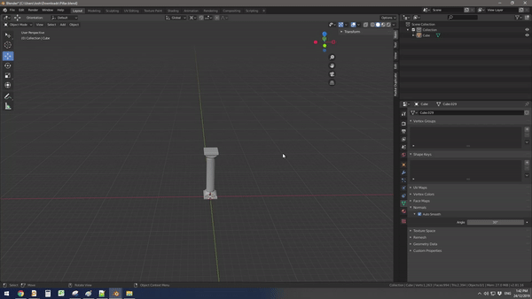

# Blender Radial Duplicate Tool 

*Tested and works on Blender 2.81a*

My mate, Liam McLachlan, mentioned how it was a tad annoying to duplicate meshes in a circle / radial fashion in Blender quickly; pre-existing methods in Blender are too cumbersome. So as a Christmas present I helped whip up this quick tool for him!

There were a few folks on Twitter who wanted this tool as well so I figured I'd share it here publicly. 

## Features
- Quickly duplicate objects in a circle / radial fashion. 
- Set: number of duplicates, position offset, if duplicated objects are linked and whether they should rotate towards the centre.
- My mum thought it was cool. 

## Installation Guide
1. Download or clone this repo locally. 

2. Navigate to the following within Blender:
Edit->Preferences...->Add-ons->Install...

3. Select the Python script from this repository:
*blender_radial_duplicate_tool.py*

4. It should now appear in the add-ons window. Tick the checkbox next to the *Radial Duplicate* add-on to enable it.

5. You should now find the *Radial Duplicate* tab in the View3D Sidebar. Refer to the gif above if necessary. 
## Authors
[Josh Caratelli](http://www.joshcaratelli.com)

Liam McLachlan

## Questions?
Easiest thing to do would be message me on Twitter: [@josh_caratelli](https://twitter.com/josh_caratelli)

